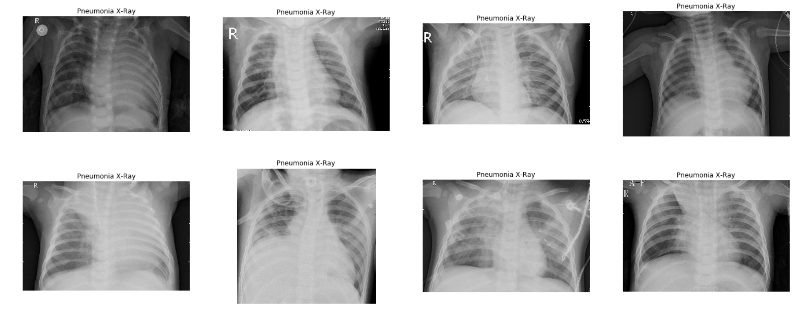
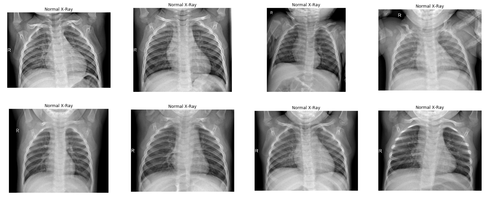
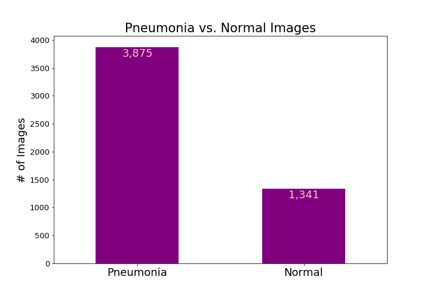
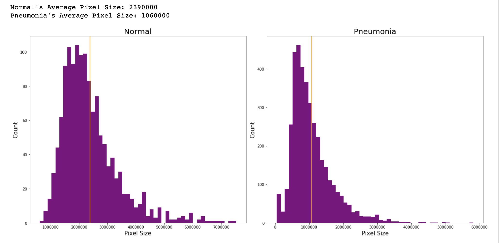
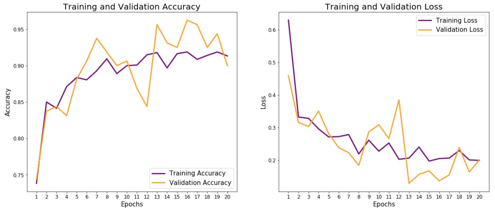

# Technical Report: Pneumonia Detection Image Classification
---

## Problem Statement:
---
The objective is to implement a Convolutional Neural Network (CNN) to classify whether patients have pneumonia based on their chest x-ray images. In this binary classification problem, predicting pneumonia is the positive target class and not having pneumonia is the non-target class. As a result, there are two types of misdiagnosis errors, type I (false positives) and type II (false negatives). Though both errors are misdiagnoses, type II errors are worse than type I errors. A type II error is to predict a patient as not having a pneumonia, but in reality they actually do. In contrast, a type I error is to predict a patient to have pneumonia, but in reality they do not. Type II errors obviously have dire consequences because diagnosing pneumonia earlier and alerting a patient is the best course of action to improve chances for better recovery. As a result, we will focus on minimizing type II errors by optimizing the sensitivity (recall) rate, which is the proportion of patients with pneumonia who test positive.

## Data:
---
The dataset consist of x-ray images of patients' chest. The images can be found from [Mendeley's data site](https://data.mendeley.com/datasets/rscbjbr9sj/2). There are 5856 total images, where 5216 are from the training folder and 656 from the testing/validation folder.

The dataset has the following directory structure:

<pre>
<b>data</b>
|__ <b>train</b>
    |______ <b>PNEUMONIA</b>: [pneumonia_0.jpg, pneumonia_1.jpg, pneumonia_2.jpg ....]
    |______ <b>NORMAL</b>: [normal_0.jpg, normal_1.jpg, normal_2.jpg ...]
|__ <b>test</b>
    |______ <b>PNEUMONIA</b>: [pneumonia_0.jpg, pneumonia_1.jpg, pneumonia_2.jpg ....]
    |______ <b>NORMAL</b>: [normal_0.jpg, normal_1.jpg, normal_2.jpg ...]
</pre>

#### Pneumonia X-Rays

To the naked eye, there are visual differences between the x-rays of pneumonia patients to normal patients.

#### Normal X-Rays

Since pneumonia causes lungs to inflame and fill up with fluid, there is more 'cloudiness' that fill up the volume within the ribcage for pneumonia patients. It also appears that normal patients have a brighter and whiter ribcages along their edges than their pneumonia counterparts.

## Exploratory Data Analysis:
---
In the EDA process, I am observing a few trends. First, the classes are unbalanced in the training dataset, which might cause the model to bias towards the majority class in detecting pneumonia while treating normal images as noise. 

The second graph plots the distribtion of the image size based on its pixels. As you can see there is a pretty big difference in x-ray image sizes between normal and pneumonia images. The normal average pixel size is 2.4 million vs pneumonia's 1.1 million. Furthermore, some images are as small as 50,000 pixels and others as large as 7 million. For the model, the images are normalized by being resized to 224 x 224 pixels.

## Modeling:
---
Keras' Convolutional Neural Network model was implemented to classify whether a patient has pneumonia. A CNN is used to capture the spatial distributions in an image by applying the aforementioned filters. 

**Conv2D Layer** is a set of learnable filters. Using the kernel filter, each filter transforms a part of the image to transform parts of the image. Conv2D also has two padding options:
1. Valid Padding - reduces convolved feature dimensionality
2. Same Padding - either increases or leaves the dimensionality alone.

Essentially, the first Conv2D layer captures low-level features such as the images' edges, colors, and gradient orientation. 

Added Conv2D layers allow the model to learn high-level features such as identifying the ribs and lungs in the images.

**Max Pooling Layers** reduce the spatial size of the convolved features and returns the max value from the portion of the image covered by the kernel for three reasons:
1. Decrease the computation power to process the data by dimensionality reduction
2. Extract dominant features by training the model
3. Reduce noise

**Flatten Layer** converts all of the learned features from the previous convolutional layers to a format that can be used by the densely connected neural layer

**Dense Layers** are used to generate the final prediction. It takes in the number of output nodes and has an activation function which we will use the sigmoid activation function. The values for the sigmoid range between 0 and 1 that allows the model to perform a binary classification. 

The first Conv2D is the input layer which takes in the images that have been converted to 224x224x3 floating point tensors.

`ReLu` (recified linear unit) is used as the activation function max(0,x) for the convolutional 2D layers. Essentially, until a threshold is hit, it doesn't activate!

[source](https://missinglink.ai/guides/keras/using-keras-flatten-operation-cnn-models-code-examples/)

## Model Evaluation:
---
After running the CNN with 20 epochs with batch sizes of 128, it appears both training and validation accuracy scores converge to higher accuracy percentages, meaning the model is not overfit. Furthermore, the loss score for both training and validation decrease overall as the number of epochs increase. The model is able to predict whether a patient has pneumonia with **86.7% accuracy**, which is not bad, but can definitely be better.

In our simple model, we were able to obtain a precision of 59.87% and recall of 70.85% which can definitely be improved.

## Future Steps:
---
There is always a need for future steps. I am currently testing out CNN models with more layers and layers and different layers such as separable convolutions. Check back for improvements!